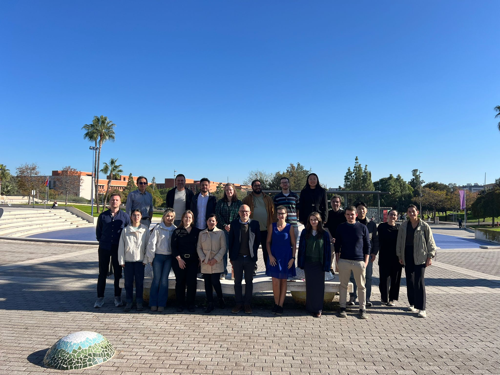
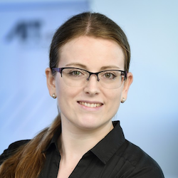
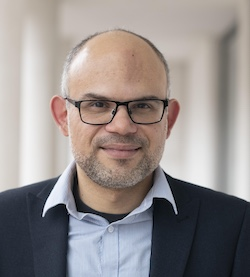
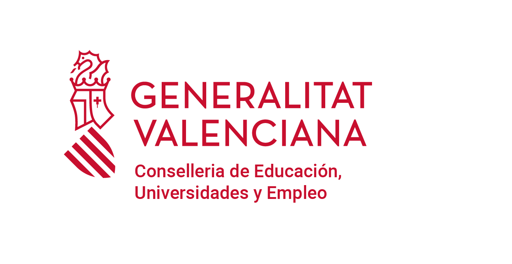

```{r setup, include=FALSE}
knitr::opts_chunk$set(echo = FALSE)

# Learn more about creating websites with Distill at:
# https://rstudio.github.io/distill/website.html

# Learn more about publishing to GitHub Pages at:
# https://rstudio.github.io/distill/publish_website.html#github-pages

```

```{r meta, echo=FALSE}
library(metathis)
meta() %>%
  meta_name("github-repo" = "BEGIN-StAndrews/agilephdschool2024") %>%
  meta_social(
    title = "AGILE PhD School 2024",
    url ="https://github.com/BEGIN-StAndrews/agilephdschool2024"
  )
```



**November 27th to 29th 2024,** at the **Universitat Jaume I, Castellón
de la Plana** (Spain)

The AGILE PhD school is designed to connect PhD students from various
countries. Its goal is to provide a forum for PhD students to showcase
their research progress, exchange ideas, engage in discussions on
geospatial methods, and enhance their geoinformatics-related skills.

Participation in the school will enable attendees to:

-   Be exposed to the diversity of fields and common features of our
    domain
-   Exchange ideas about the PhD process itself
-   Develop their network
-   Be exposed to the reproducibility practices in the GIScience field.

## Slides and Material
```{=html}

<div class="tabs">
  <button class="tab-button active" data-tab="keynotes">Keynote Speakers</button>
  <button class="tab-button" data-tab="organizers">Organizers</button>
  <button class="tab-button" data-tab="phd">PhD Candidates</button>
</div>

<div class="tab-content active" id="keynotes"></div>
<div class="tab-content" id="organizers"></div>
<div class="tab-content" id="phd"></div>

<script>
  document.addEventListener('DOMContentLoaded', function () {
    const presentations = {
      keynotes: [
        { file: "slides/keynotes/2024-11-28_AGILEPhDSchool-GeoAI_Graser.pdf", title: "Mobility Data Science in the Age of AI" },
        { file: "slides/keynote2.pdf", title: "Keynote 2: Innovations in Urban Analytics" }
      ],
      organizers: [
        { file: "slides/organisers/AGILE-Intro.pdf", title: "Intro School"},
        { file: "slides/organisers/AGILE-Closing.pdf", title: "Closing Remarks"},
        { file: "slides/organisers/AR_slide_2024_final.pdf", title: "Alina Ristea - Research Agenda"},
        { file: "slides/organisers/Hoda_Allahbakhshi_Agile.pdf", title: "Hoda Allahbakhshi- Research Agenda"},
        { file: "slides/organisers/FBP_slide_2024.pdf", title: "Fernando Benitez-Paez - Research Agenda"},
        
      ],
      phd: [
        { file: "slides/phd1.pdf", title: "PhD Talk: Machine Learning in Geosciences" },
        { file: "slides/phd2.pdf", title: "PhD Talk: Land-Use Change Analysis" }
      ]
    };

    function populateTabContent(category, containerId) {
      const container = document.getElementById(containerId);
      presentations[category].forEach(presentation => {
        const link = document.createElement('a');
        link.href = presentation.file;
        link.target = "_blank";
        link.className = "presentation-item";
        link.innerHTML = `
          <span class="icon">📄</span>
          ${presentation.title}
        `;
        container.appendChild(link);
      });
    }

    populateTabContent('keynotes', 'keynotes');
    populateTabContent('organizers', 'organizers');
    populateTabContent('phd', 'phd');

    const tabButtons = document.querySelectorAll('.tab-button');
    const tabContents = document.querySelectorAll('.tab-content');

    tabButtons.forEach(button => {
      button.addEventListener('click', () => {
        const targetTab = button.dataset.tab;

        tabButtons.forEach(btn => btn.classList.remove('active'));
        tabContents.forEach(content => content.classList.remove('active'));

        button.classList.add('active');
        document.getElementById(targetTab).classList.add('active');
      });
    });
  });
</script>

<style>
  .tabs {
    display: flex;
    gap: 10px;
    margin-bottom: 20px;
  }
  .tab-button {
    padding: 10px 20px;
    border: 1px solid #ddd;
    border-radius: 5px;
    background: #f9f9f9;
    cursor: pointer;
    transition: background 0.3s;
  }
  .tab-button.active {
    background: #007bff;
    color: #fff;
    border-color: #007bff;
  }
  .tab-content {
    display: none;
  }
  .tab-content.active {
    display: block;
  }
  .presentation-item {
    display: block;
    margin: 10px 0;
    text-decoration: none;
    color: #007bff;
    font-size: 16px;
    font-weight: bold;
    border: 1px solid #ddd;
    padding: 10px;
    border-radius: 5px;
    background: #f9f9f9;
    box-shadow: 2px 2px 8px rgba(0, 0, 0, 0.1);
    transition: background 0.3s, color 0.3s;
  }
  .presentation-item:hover {
    background: #e9f5ff;
    color: #0056b3;
  }
  .presentation-item .icon {
    margin-right: 10px;
    font-size: 18px;
  }
</style>


```

## Pictures

```{=html}
<link href="https://cdn.jsdelivr.net/npm/lightbox2@2.11.4/dist/css/lightbox.min.css" rel="stylesheet">
<script src="https://cdn.jsdelivr.net/npm/lightbox2@2.11.4/dist/js/lightbox.min.js"></script>

<div class="gallery-container">
  <div class="gallery" id="imageGallery"></div>
</div>

<script>
  document.addEventListener('DOMContentLoaded', function () {
    const imageFolder = "pictures/";
    const imageCount = 13; // Update with the total number of images
    const gallery = document.getElementById('imageGallery');

    for (let i = 1; i <= imageCount; i++) {
      const imgSrc = `${imageFolder}image${i}.jpeg`;

      // Create <a> and  elements
      const link = document.createElement('a');
      link.href = imgSrc;
      link.setAttribute('data-lightbox', 'gallery');
      link.setAttribute('data-title', `Image ${i}`);

      const img = document.createElement('img');
      img.src = imgSrc;
      img.alt = `Image ${i}`;
      img.loading = "lazy"; // Lazy loading for better performance

      link.appendChild(img);
      gallery.appendChild(link);
    }
  });
</script>

<style>
  .gallery-container {
    max-height: 80vh; /* Set maximum height for the gallery */
    overflow-y: auto; /* Allow scrolling if there are many images */
    padding: 10px;
    border: 1px solid #ddd;
    border-radius: 5px;
  }
  .gallery {
    display: grid;
    grid-template-columns: repeat(auto-fill, minmax(150px, 1fr)); /* Adjust for smaller images */
    gap: 10px;
  }
  .gallery img {
    width: 100%;
    height: auto;
    border: 1px solid #ccc;
    border-radius: 5px;
    box-shadow: 2px 2px 8px rgba(0, 0, 0, 0.1);
  }
</style>
```

## Why to participate?

Attending the AGILE PhD School offers a great opportunity for PhD
students within the European GIScience community. Ideally for PhD
students in their second year or nearing their dissertation. The school
aims to foster strong community academic connections, where participants
will benefit from valuable insights shared by former AGILE PhD School
alumni.

We have prepared an agenda to not only enhance students' scientific
writing skills but also deepen their understanding of GeoAI research.
The AGILE PhD school provides a platform for the students to amplify the
impact of their ongoing research through direct engagement with the
AGILE community, get new ideas, and seek feedback about current
preliminary results and share experiences about the PhD journey.

## Where will it take place?

For the second time, the AGILE PhD school will be held in Castellon, which is situated between the beautiful Mediterranean Sea and the stunning Sierra de Espadán mountains. The 7th Edition of the school will be hosted at the University Jaume I, with the support of the [Geospatial Research Group— GeoTec](https://geotec.uji.es/). Castellon is conveniently located between Valencia and Barcelona. 

```{=html}
<iframe src="https://uostandrews.maps.arcgis.com/apps/instant/basic/index.html?appid=edf6338814af456a9d52ccbab670f042" width="400" height="600" frameborder="0" style="border:0" allowfullscreen>iFrames are not supported on this page.</iframe>
```

## Keynote Speakers

### **Anita Graser**

```{=html}
<div style="display: flex; align-items: flex-start; flex-wrap: wrap;">
    
    <div style="flex: 1;">
        <p>
            Is a spatial data scientist, open source GIS advocate, and author with a background in geographic information science. 
            She is currently Senior Scientist at AIT - The Austrian Institute of Technology in Vienna. She serves on the QGIS project 
            steering committee and has published several books about QGIS. Furthermore, she develops tools, such as the popular 
            MovingPandas. Her contributions include developing QGIS plugins, writing user-friendly tutorials, and authoring books 
            such as "Learning QGIS" and "QGIS Map Design." Anita also runs a widely-followed blog, 
            <a href="https://anitagraser.com/" target="_blank">Free and Open Source GIS Ramblings</a>, where she shares insights 
            and tutorials on open-source GIS solutions.
        </p>
    </div>
</div>
```

### **Prof. João Porto de Albuquerque**

```{=html}
<div style="display: flex; align-items: flex-start; flex-wrap: wrap;">
    
    <div style="flex: 1;">
        <p>
            Is Professor in Urban Analytics at Urban Studies in the School of Social and Political Sciences at the University 
            of Glasgow and Deputy Director of the <a href="https://www.ubdc.ac.uk/" target="_blank">Urban Big Data Centre (UBDC)</a>, 
            where he leads the 
            "<a href="https://www.ubdc.ac.uk/research/research-projects?topic=Urban+Sustainability+%26+Participation" target="_blank">
            Urban Sustainability and Participation</a>" theme. Professor Porto de Albuquerque is a geographer and computer scientist 
            with an interdisciplinary background who conducts research on geographic information and urban sustainability, focusing 
            on addressing inequalities in data and society. His work cuts across the borders between social and computing sciences, 
            as well as between the global South and the global North. His pioneering and award-winning approach to 
            <strong>participatory urban analytics</strong> combines participatory methods (e.g., citizen science, participatory GIS, 
            action research, participatory software design) and geo-computational data science.
        </p>
    </div>
</div>

```

### **Rafael Verduzco Torres**

```{=html}
<div style="display: flex; align-items: flex-start; flex-wrap: wrap;">
    
    <div style="flex: 1;">
        <p>
            Rafael is a Lecturer in Urban Analytics at the Division of Urban Studies and Social Policy. His work centres on the examination and potential applications of emerging forms of data and innovative methodologies to address urban mobility and transport research questions. He is particularly interested in the interactions between spatial accessibility, the urban economy, and social equity. Rafael contributes to teaching in the Urban Analytics and Urban Transport programmes and is also a member of the Urban Big Data Centre (UBDC), where he often collaborates with the Data Service in the development and curation of various datasets.
        </p>
    </div>
</div>
```


## Selected Candidates

Get to know the 2024 PhD candidates who have been selected, find out their background, which AGILE institutions they are currently affiliated with, and most importantly, their research topics.

```{=html}
<iframe src="https://storymaps.arcgis.com/stories/6a7281f6f5ad417eb3da70151a67bac2?cover=false" width="100%" height="700px" frameborder="0" allowfullscreen allow="geolocation"></iframe>
```


## Programme

*Last Update: 25 Nov, 14:00 - Details in progress*

### Meeting room

The PhD school will take place at the University Jaume I, in the Building called: **"Investigació II"** --> Level 0 - **NB0003CC meeting room**. [Open GIS App Link](https://gis.uji.es/ujiapps/bessodigital/localitzacioespais/?query=1831cf62f4d-layer-3,codificacion,NB0003CC) Use the map to locate where meeting room is located inside the hosted university.


```{=html}
<iframe src="https://uostandrews.maps.arcgis.com/apps/instant/basic/index.html?appid=9c9cb0e412814157bac6ffd23346231b" width="400" height="600" frameborder="0" style="border:0" allowfullscreen>iFrames are not supported on this page.</iframe>
```

### Day 1: Arrival to the Venue

#### Tuesday, November 26th 2024

Arrival of participants. Accommodation: [Doña Lola
hotel](http://www.hoteldonalola.com/)

### Day 2: Welcoming and Fundamental Academic Skills

#### Wednesday, November 27th 2024

*Facilitators*: [Alina Ristea](https://www.linkedin.com/in/risteaalina),
[Hoda Bakhshi](https://www.linkedin.com/in/hoda-bakhshi-999a1a33/),
[Diego
Pajarito](https://www.linkedin.com/in/diego-pajarito-grajales-26277232/),
[Fernando Benitez-Paez](https://www.linkedin.com/in/mfbenitezp/)

*Meeting room*: [NB0003CC
room](https://gis.uji.es/ujiapps/bessodigital/localitzacioespais/?query=1831cf62f4d-layer-3,codificacion,NB0003CC),
Edificio de Investigación II, NB, Universitat Jaume I

**Morning session**

-   09:30 - 10:00 - Intro and welcoming
-   10:00 - 11:00 - Research Overview: Crime Analysis, crowd-sourcing mapping, spatial accessibility and movement analytics
-   11:00 - 11:30 - Coffee Break 
-   11:30 - 13:00 - Panel Discussion – What does that mean to be a PhD
    Student (The joy and the struggles) - Open Discussion with selected candidates 
-   13:00 - Lunch at *Restaurante Agora* in campus

**Afternoon session**

-   15:00 - 16:00 - Three-minute abstract presentations by participants
-   16:00 - 17:00 - Scientific paper – Research Proposal

### Day 3: GeoAI for the Social Good

#### Thursday, November 28th 2024

*Facilitators*: [Alina Ristea](https://www.linkedin.com/in/risteaalina),
[Hoda Bakhshi](https://www.linkedin.com/in/hoda-bakhshi-999a1a33/),
[Diego
Pajarito](https://www.linkedin.com/in/diego-pajarito-grajales-26277232/),
[Fernando Benitez-Paez](https://www.linkedin.com/in/mfbenitezp/)

*Meeting room*: [NB0003CC
room](https://gis.uji.es/ujiapps/bessodigital/localitzacioespais/?query=1831cf62f4d-layer-3,codificacion,NB0003CC),
Edificio de Investigación II, NB, Universitat Jaume I

**Morning session**

-   09:00 - 10:00 [Anita
    Graser](https://anitagraser.com/) ( [Austrian Institute of
    Technology](http://www.ait.ac.at/) in Vienna):
    
```{=html}
    <div style="border: 1px solid #ccc; padding: 10px; border-radius: 8px; max-width: 800px; margin: auto; font-family: Arial, sans-serif;">
    <h3>Mobility Data Science in the Age of AI</h3>
    <p> "A computer can never be held accountable, therefore a computer must never make a management decision." (IBM 1979)
    </p>
    <p> The current AI hype, driven by generative AI and particularly large language models (LLMs), is creating excitement, fear, and inflated expectations. In this talk, I will argue that to transform this hype into sustainable and positive development, we need to find ways to empower people to take control of their own assistive AI technology. To achieve this, spatial data science in general, and mobility data science in particular, must up their game and embrace open-source development and collaboration.
    </p>
</div>

```


-   10:00 - 11:00 - Post-Keynote Discussion and Brainstorming:
    Participants should form groups to brainstorm potential research
    questions or projects using Geo AI and open-source tools, guided by
    the insights from the keynote.

Each group selects one research proposal/idea and outlines how to
enhance it using the tools and methods discussed. Outcome required:
Develop a preliminary outline or draft of a potential journal paper,
highlighting the problem, Research Question, methodology, and expected
outcomes.

-   Coffee break

-   11:30 - 13:30 - Post-Keynote Discussion and Brainstorming,

-   Lunch at *Restaurante Agora* in campus

**Afternoon session**

-   15:00 - 16:00 - [Prof. Joao Porto de Albuquerque -
    Professor in Urban Analytics (Urban Studies & Social Policy)
    University of
    Glasgow](https://www.gla.ac.uk/schools/socialpolitical/staff/joaoportodealbuquerque/)
    
```{=html}

<div style="border: 1px solid #ccc; padding: 10px; border-radius: 8px; max-width: 800px; margin: auto; font-family: Arial, sans-serif;">
    <h3>Participatory Urban Analytics for Inclusive Data Innovations and Artificial Intelligence: Enabling Transformative Public Policy</h3>
    
    <p> Data innovations and Artificial Intelligence have the potential to support cities in addressing the most pressing challenges posed by the current triple planetary emergency and its climate, ecology, and social inequality dimensions. However, solutions built upon biased or partial data will not address the required challenges, since they may systematically misrepresent the realities of the most vulnerable communities. To overcome this, the talk introduces an approach to participatory urban analytics which bridges citizen participation and data science to address inequalities in data and society. Results from this approach show significant social impacts in the context of resilience to flood and landslide disasters in Latin American disadvantaged communities (the Waterproofing Data and URBE Latam projects) and the improvement of access to urban infrastructure and services in informal settlements in Kenya and Nigeria (IDEAMAPS Data Ecosystem project).
    </p>
</div>
````

-   16:00 - 18:00 - Post-Keynote Discussion and Brainstorming:
    Continuation of the morning brainstorming and drafting the paper
    idea based on the keynote speakers tools, methods and suggestions.

-   20:00 - N/A - Social Dinner: Restaurant [La Tagliatella](https://www.latagliatella.es/restaurante-italiano/castellon)
    - Address: C/ Lagasca, esquina Prim 9, 12003, Castellón de la Plana, Spain - 
    - GM Location: https://www.google.com/maps/place/39.9837973,-0.0303198
```{=html}
<iframe src="https://uostandrews.maps.arcgis.com/apps/instant/basic/index.html?appid=a28c8dc293674721ba6644daf7ef3ca9
" width="400" height="600" frameborder="0" style="border:0" allowfullscreen>iFrames are not supported on this page.</iframe>
```


### Day 4: Final presentations and closing remarks

#### Friday, November 29th 2024

*Facilitators*: [Alina Ristea](https://www.linkedin.com/in/risteaalina),
[Hoda Bakhshi](https://www.linkedin.com/in/hoda-bakhshi-999a1a33/),
[Diego
Pajarito](https://www.linkedin.com/in/diego-pajarito-grajales-26277232/),
[Fernando Benitez-Paez](https://www.linkedin.com/in/mfbenitezp/)

*Meeting room*: [NB0003CC
room](https://gis.uji.es/ujiapps/bessodigital/localitzacioespais/?query=1831cf62f4d-layer-3,codificacion,NB0003CC),
Edificio de Investigación II, NB, Universitat Jaume I

**Morning session**

-   10:00 - 11:00 - [Dr. Rafael Verduzco-Torres -
    Lecturer in Urban Analytics, University of
    Glasgow](https://www.gla.ac.uk/schools/socialpolitical/staff/joserafaelverduzcotorres) 
    
```{=html}

<div style="border: 1px solid #ccc; padding: 10px; border-radius: 8px; max-width: 800px; margin: auto; font-family: Arial, sans-serif;">
    <h3>Open Science and Reproducibility</h3>
    
    <p>Reproducibility is a cornerstone of reliable research, allowing others to validate findings by following the same methods and data to achieve similar results. This talk will introduce the current landscape of open science and reproducibility within the field of GIScience. Specifically, it will guide doctoral students through the Agile Reproducibility Guidelines and essential resources to enhance the reproducibility of their own work. Additionally, it will introduce The Turing Way—a project, handbook, and community dedicated to reproducible, ethical, and collaborative data science.
    </p>
</div>
````

-   11:30 - 13:00: Final Presentation and Feedback Session:

Based on the previous brainstorming sessions, and the progress with the
drafted ideas, groups should prepare a brief presentation (max 3 slide)
of their enhanced research proposal or draft journal paper, emphasizing
the use or integration of keynote speakers' tools, methods or ideas.

-   13:00 - 13:30 - Closing remarks

-   Lunch at *Restaurante Agora* in campus


## How to apply

> The call to submit abstract has finished and the candidates were
> already selected, please keep an eye on the next AGILE PhD School.

To join the AGILE PhD School 2024, participants are required to submit a
300 to 500-word abstract summarising their ongoing research. The
abstract may include preliminary results and highlight the relevance of
your work to the main topic of the AGILE PhD School: GeoAI for the
Social Good.

-   Submit your abstract to:
    [Fernando.Benitez\@st-andrews.ac.uk](mailto:Fernando.Benitez@st-andrews.ac.uk).
-   Submission Deadline: ~~**August 27, 2024**~~

Your submission will be evaluated based on the clarity of your research,
the significance of your preliminary findings, and their potential
impact on the field of GeoAI.

### Formatting instructions

Abstracts must be prepared using either the Word Document template or
the LaTeX Document template provided at
<https://www.agile-giscience-series.net/agile-giss-templates.html>.
Abstracts must be written in English according to the formatting
guidelines. Note: Latex recommended editor: Overleaf.

### Financial support

Financial assistance is available to the selected participants. While we
wish we could cover all the related expenses, our budget is limited, and
participants may be required to contribute. More details will be
provided to the selected participants.


## Organising Commitee

-   [Carlos Granell](http://carlosgranell.eu/) - University Jaime I,
    Spain
-   [Alina Ristea](https://www.linkedin.com/in/risteaalina) - UCL, The
    UK
-   [Hoda Bakhshi](https://www.linkedin.com/in/hoda-bakhshi-999a1a33/) -
    University of Zurich, Switzerland
-   [Diego
    Pajarito](https://www.linkedin.com/in/diego-pajarito-grajales-26277232/) -
    University of Glasgow, The UK
-   [Fernando Benitez-Paez](https://www.linkedin.com/in/mfbenitezp/) -
    University of St Andrews, The UK

## Sponsors

```{=html}
<style>
        .sponsor-container {
            display: grid;
            grid-template-columns: 1fr;
            grid-template-rows: auto auto auto;
            gap: 5px;
            max-width: 800px;
            margin: 0 auto;
        }

        .leader-sponsor {
            grid-column: span 3;
            text-align: center;
        }

        .second-row {
            display: grid;
            grid-template-columns: repeat(5, 1fr);
            gap: 5px;
        }

        img {
            max-width: 100%;
            height: auto;
        }

        .logo {
            padding: 5px;
            display: flex;
            justify-content: center;
            align-items: center;
        }
    </style>
```

```{=html}

<div class="sponsor-container">
    <!-- First Row: Leader Sponsor -->
    <div class="leader-sponsor logo">
        
    </div>

    <!-- Second Row: Three Sponsors -->
    <div class="second-row">
        <div class="logo">
            
        </div>
        <div class="logo">
            
        </div>
        <div class="logo">
            
        </div>
        <div class="logo">
            
        </div>
        <div class="logo">
            
        </div>
    </div>
</div>

````

