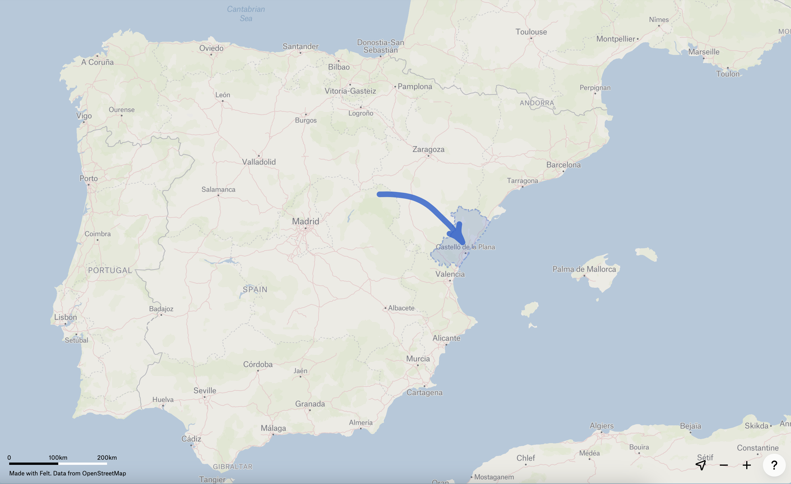

```{r setup, include=FALSE}
knitr::opts_chunk$set(echo = FALSE)

# Learn more about creating websites with Distill at:
# https://rstudio.github.io/distill/website.html

# Learn more about publishing to GitHub Pages at:
# https://rstudio.github.io/distill/publish_website.html#github-pages

```

```{r meta, echo=FALSE}
library(metathis)
meta() %>%
  meta_name("github-repo" = "BEGIN-StAndrews/agilephdschool2024") %>%
  meta_social(
    title = "AGILE PhD School 2024",
    url ="https://github.com/BEGIN-StAndrews/agilephdschool2024"
  )
```


November 27th to 29th 2024, at the Universitat Jaume I, Castellón de la
Plana (Spain)

The AGILE PhD school is designed to connect PhD students from various
countries. Its goal is to provide a forum for PhD students to showcase
their research progress, exchange ideas, engage in discussions on
geospatial methods, and enhance their geoinformatics-related skills.

Participation in the school will enable attendees to:

-   Be exposed to the diversity of fields and common features of our
    domain
-   Exchange ideas about the PhD process itself
-   Develop their network
-   Be exposed to the reproducibility practices in the GIScience field.

## Why to participate?

Attending the AGILE PhD School offers a great opportunity for PhD students within the European GIScience community. Ideally for PhD students in their second year or nearing their dissertation. The school aims to foster strong community academic connections, where participants will benefit from valuable insights shared by former AGILE PhD School alumni. 

In this ocasion, we have prepared an agenda to not only enhance students' scientific writing skills but also deepen their understanding of GeoAI research. The AGILE PhD school provides a platform for the students to amplify the impact of their ongoing research through direct engagement with the AGILE community, get new ideas, seek feedback about current preliminary results and share experience about the PhD journey.

## Where will take place?

The 7th edition of the AGILE PhD school will take place in Castellón de la Plana, Spain. Situated between the beautiful Mediterranean Sea and the stunning Sierra de Espadán mountains, Castellón provides an inspiring backdrop for any academic retreat. Come and experience Spanish hospitality, delicious cuisine, and vibrant local culture while collaborating with fellow researchers.



## Programme.

*Note: timetable is indicative. Details in progress*

### Day 1: Arrival to the Venue

#### Tuesday, November 26th 2024

Arrival of participants. Accommodation: [Doña Lola
hotel](http://www.hoteldonalola.com/)

### Day 2: Welcoming and Fundamental Academic Skills

#### Wednesday, November 27th 2024

*Facilitators*: [Alina Ristea](https://www.linkedin.com/in/risteaalina),
[Hoda Bakhshi](https://www.linkedin.com/in/hoda-bakhshi-999a1a33/),
[Diego
Pajarito](https://www.linkedin.com/in/diego-pajarito-grajales-26277232/),
[Fernando Benitez-Paez](https://www.linkedin.com/in/mfbenitezp/)

*Meeting room*: TBD

**Morning session**

-   09:00 - 10:00 - Intro and welcoming
-   Coffee break
-   10:30 - 13:30 ECR Panel Discussion – What does that mean to be a PhD
    Student (The joy and the struggles)
-   Lunch at *Restaurante Agora* in campus

**Afternoon session**

-   15:00 - 16:00 - Three-minute abstract presentations by participants
-   16:00 - 17:00 - Scientific paper - The basic structure
-   21:00 **Dinner** TBD

### Day 3: GeoAI for the Social Good

#### Thursday, November 28th 2024

*Facilitators*: *Facilitators*: [Alina
Ristea](https://www.linkedin.com/in/risteaalina), [Hoda
Bakhshi](https://www.linkedin.com/in/hoda-bakhshi-999a1a33/), [Diego
Pajarito](https://www.linkedin.com/in/diego-pajarito-grajales-26277232/),
[Fernando Benitez-Paez](https://www.linkedin.com/in/mfbenitezp/)

*Meeting room*: TBD

**Morning session**

-   09:00 - 10:00 Keynote Speaker No 1 – Anita Graser
-   10:00 - 11:00 - Post-Keynote Discussion and Brainstorming:
    Participants should form goups to brainstorm potential research
    questions or projects using GeoAI and open-source tools, guided by
    the insights from the keynote.

Each group selects one research proposal/idea and outlines how to
enhance it using the tools and methods discussed. Outcome requiered:
Develop a preliminary outline or draft of a potential journal paper,
highlighting the problem, Research Question, methodology, and expected
outcomes.

-   Coffee break

-   11:30 - 13:30 - Post-Keynote Discussion and Brainstorming,

-   Lunch at *Restaurante Agora* in campus

**Afternoon session**

-   15:00 - 16:00 - Keynote Speaker No 2 – TBD

-   16:00 - 18:00 - Post-Keynote Discussion and Brainstorming:
    Continuation of the morning brainstomring and drafting the paper
    idea based on the keynote speakers tools, methods and suggestions.

-   Begining at 19:30, **chat, craft beers & dinner** at [The Temple
    Bar](https://www.thetemplebarcastellon.com/) in Castellón.
    [Location](https://www.google.es/maps/place/Temple+Smash+Burger/@39.9860844,-0.0330139,17z/data=!3m1!4b1!4m5!3m4!1s0xd5fffd6d25bbd95:0x7eca84b89ede24dc!8m2!3d39.9860803!4d-0.0308252)

### Day 4: Final presentations and closing remarks

#### Friday, November 29th 2024

*Facilitators*: [Alina Ristea](https://www.linkedin.com/in/risteaalina),
[Hoda Bakhshi](https://www.linkedin.com/in/hoda-bakhshi-999a1a33/),
[Diego
Pajarito](https://www.linkedin.com/in/diego-pajarito-grajales-26277232/),
[Fernando Benitez-Paez](https://www.linkedin.com/in/mfbenitezp/)

*Meeting room*: TBD

**Morning session**

-   10:00 - 11:00 Open Science and Reproducibility – The Turing Way
-   Coffee break
-   11:30 - 13:00: Final Presentation and Feedback Session:

Based on the previous brainstroming sessions, and the progress with the
drafted ideas, groups should prepare a brief presentation (max 3 slide)
of their enhanced research proposal or draft journal paper, emphasizing
the use or integration of keynote speakers' tools, methods or ideas.

-   13:00 - 13:30 Closing remarks

-   Lunch at *Restaurante Agora* in campus

## Organizing Commitee

-   [Carlos Granell](http://carlosgranell.eu/) - University Jaime I, Spain
-   [Alina Ristea](https://www.linkedin.com/in/risteaalina) - UCL, The UK
-   [Hoda Bakhshi](https://www.linkedin.com/in/hoda-bakhshi-999a1a33/) - University of Twente, Netherlands 
-   [Diego Pajarito](https://www.linkedin.com/in/diego-pajarito-grajales-26277232/) - University of Glasgow, The UK
-   [Fernando Benitez-Paez](https://www.linkedin.com/in/mfbenitezp/) - University of St Andrews, The UK


## Sponsors 

<style>
.custom-image {
  width: 300px;
  height: auto;
  margin: 0 10px;
}
</style>

<style>
.lead-image {
  width: 100%;
  height: auto;
  margin: 0 10px;
}
</style>


